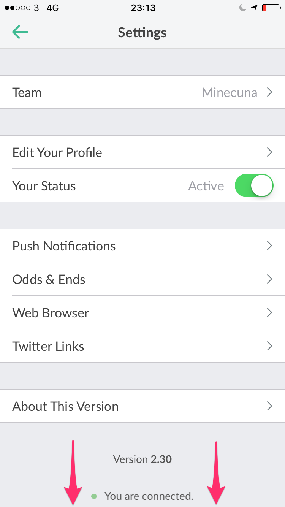

I recently tried to sign out of a team on Slack for iOS and found the process to be non-obvious and a lack of documentation made it harder. I'm writing this mostly for the next time I need to do it and have forgotten how.

Open the Team menu with the hamburger icon in the top right and tap Settings

SCROLL DOWN. It's really not obvious that there is more to the settings page.

Tap the "Sign out of Team" link.

