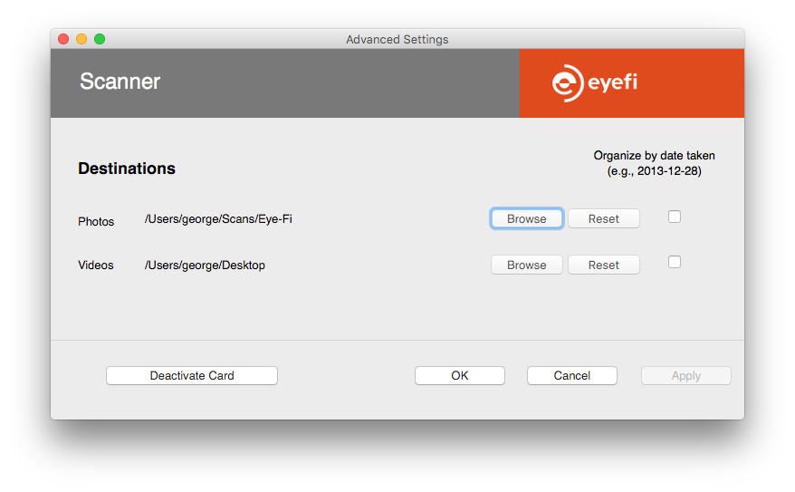
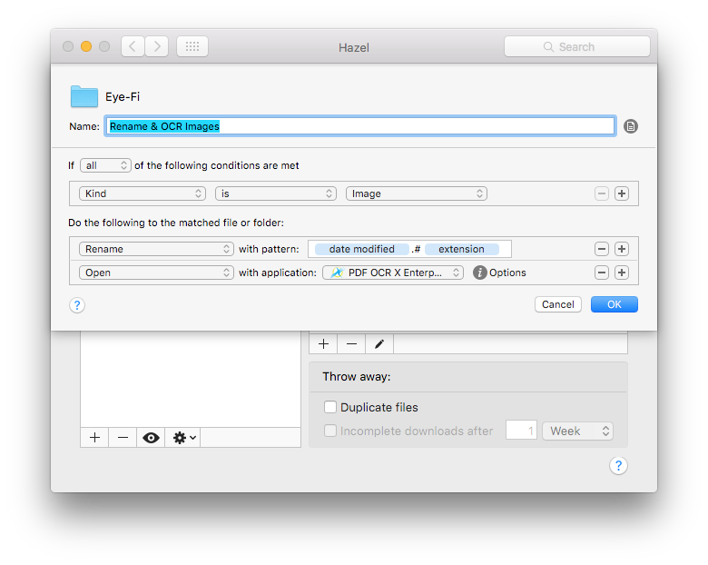
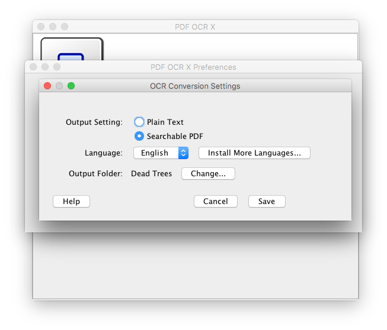
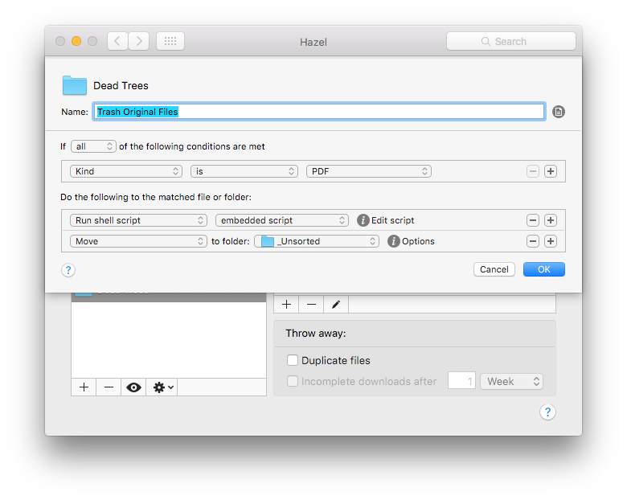

To combat my innate propensity for pack ratting, I made the decision to digitise all my documents.
Steve Losh wrote a [fantastic article][1] on how he went paper-free and much of my process is based on his flow.
However, I wanted to lay out mine for posterity (and because I'm likely to forget what I did).

Scanning is taken care of with a [Doxie One][2] saving to an [EyeFi Mobi][3] wireless SD card.
The Doxie is a small, lightweight scanner making it perfect for using whilst sat on the sofa.
The EyeFi card makes a point-to-point WiFi connection with my desktop but acts as a buffer while scanning, so I tend to sync the images it contains after scanning batches.
It also means my desktop can be off/asleep while I'm scanning elsewhere.
Although this had some downsides, which I'll discuss later.

On the desktop I have the EyeFi software configured to download files from the SD card to `~/Scans/Eye-Fi`.
The "Organize by date taken" option puts the images into sub directories.

[Hazel][4] is configured to monitor the EyeFi sync directory for images.
These images are renamed using the modified date; the `#` avoids overwriting files.
Once renamed, the images are opened with the OCR software:

I'm using [PDF OCR X Enterprise Edition][5] to generate searchable PDFs from the scanned images and put them into `~/Automation/Scans/Dead Trees`.
It's configured to generate searchable PDFs in batch mode so it won't require any interaction when run and leaves the original images alone.

Hazel watches the `Dead Trees` directory to perform a bit of house keeping.
It trashes (instead of deleting - just in case) the original images from `Pending OCR` using some python:

Image names are generated using the filenames of the PDFs Hazel sees so it only removes images that have been OCR'd.
You can find the full script [here][6].
PDFs are then moved from `Dead Trees` to `~/Documents/Unsorted`.

From the Unsorted directory I manually move the PDFs to an appropriate directory.
If the document has a sent date then I change the filename to reflect that rather than the scan date.

The initial scan of my paper work took eight evenings!

Now that the initial import is done, and I've a working directory structure, I scan my documents every 1-2 months and it takes 30 minutes at most.

This is all working smoothly now, but there are some downsides:

* The Doxie One doesn't do double sided scanning or OCR.
* Leaving my desktop Wi-Fi on crashes OS X's network stack after a few days.
* The Eyefi doesn't connect to my house Wi-Fi network.

However, none of these are a big enough issue for me to shell out more money on a new scanner.

[1]: https://stevelosh.com/blog/2011/05/paper-free/
[2]: https://www.getdoxie.com/product/one/
[3]: https://www.amazon.co.uk/gp/product/B00FG8PPXI
[4]: https://www.noodlesoft.com/hazel.php
[5]: https://solutions.weblite.ca/pdfocrx/
[6]: https://gist.github.com/ghickman/decca82fb0e67d7e6e65
