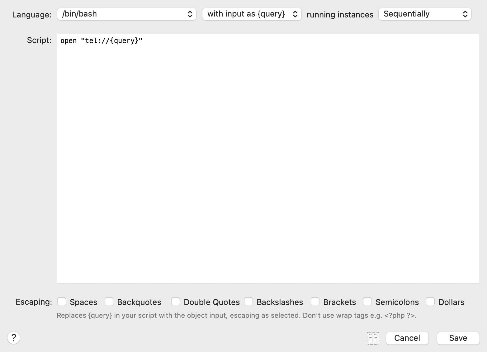

I have an Alfred workflow which lets me type `call <number>`, or hit enter on any number for a contact.
It calls `open tel://<number>` to kick off the macOS calling dialogue and saves me having to fiddle with copying a number to my phone.

At some point in the past this stopped working for numbers with spaces in them.
Having thought this was an issue with `open` or how `tel://` URLs were handled I left it be.
I don't make a lot of calls, it was fine.

Today I got annoyed at this state of affairs, always the best way to fix things.

It turns out Alfred's Run Script utility can escape various things and had been escaping the spaces passed to my script.

With those off everything is back to normal.
